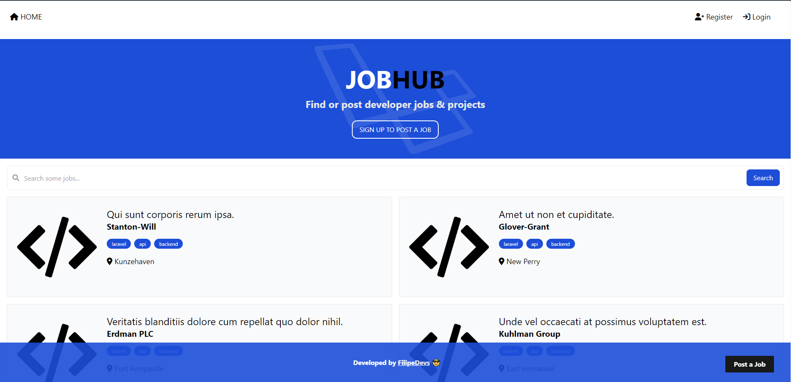

# Job listing Web App

A minimalistic job post web application developed in Laravel. This application allows employers to post job listings, and job seekers to explore and apply for available positions.

## Tech Stack

* Laravel
* TailwindCSS
* AlpineJs
* MySQL

## Features

- Authentication System:
    * Secure user authentication for authorized access.

- Job Posting:
    * Employers can create, manage, and publish job listings with essential details.

- Job Search:
    * Job seekers can explore available positions. They can refine search results using tag filters.
## Screenshots



## Usage

### Install Dependecies

To install the dependecies, run the following command :

```
composer install
```

### Create environment file

Copy the `.env.example` file to `.env`

### Generate application key

This key will be used to encrypt data (Sessions, CSRF tokens and cookies). Run the following command : 

```sh
php artisan key:generate
```

### Database 

The app uses MySQL so make sure you have it installed it and running (XAMP for example).

### Migrations 
To create all the tables and columns, run the following command : 

```
php artisan migrate
```

### Seeding The Database
To add some dummy/fake data to the database, run the following command : 
```
php artisan db:seed
```

### File Uploading
When uploading job post files (in this case images), they go to `storage/app/public`. Create a symlink with the following command to make them publicly accessible : 
```
php artisan storage:link
```

### Run The App
To run the app, run the following command :
```
php artisan serve
```
